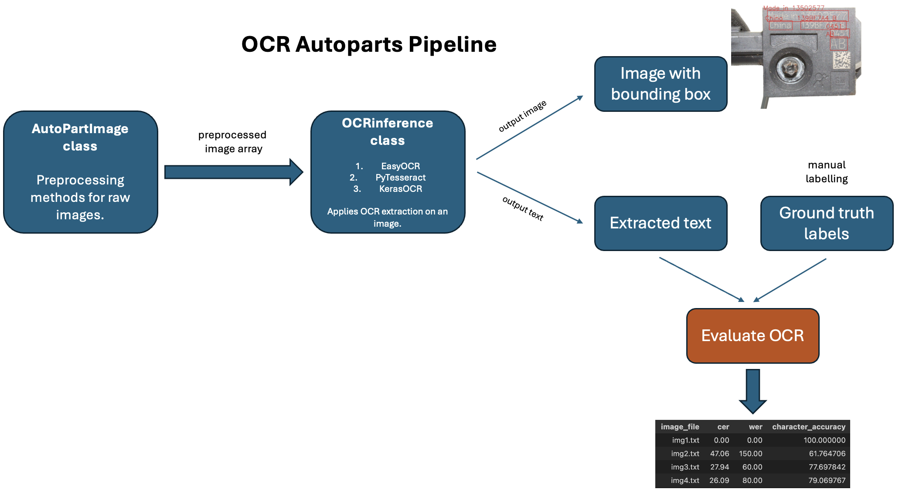

## Task 1: OCR for auto parts photos

## Contents
- [Install](#install)
- [Run and Inference](#inference)
- [Pipeline](#pipeline)
- [Evaluation](#evaluation)
- [Conclusion and Discussion](#conclusion)

## Install
1. Clone this repository and navigate to the card-ocr-autoparts folder
```bash
git clone https://github.com/dklpp/card-ocr-autoparts.git
cd card-ocr-autoparts
```
2. Create a virtual environment and install dependencies
```Shell
python -m venv ocr_venv
source ocr_venv/bin/activate
pip install -r requirements.txt
```
3. You might need to manually install the Tesseract OCR engine if you don't have it. However, it is optional, since EasyOCR was used as a final version, and it surpassed Tesseract.
```Shell
$ brew install tesseract
```

## Inference
Go to folder **modelling** and run all the cells in python notebook files: **individual_pipeline.ipynb** and **generalized_pipeline.ipynb**. These two files represent invidual preprocessing pipeline for each image, and one generalized preprocessing pipeline for all the images, respectively. These notebooks create 4 output folders in **output folder**. Each file creates resulting images with bounding boxes and predicted texts, along with predicted texts in a separate .txt file.

## Evaluation
Once text from the images is extracted, it is time to evaluate the results. For evaluation metrics it was decided to use 3 of them: Character Error Rate (CER), Word Error Rate (WER), and Character Accuracy. Go to the file **evaluation.ipynb** and run all the cells. The file produces two dataframes with evaluation metrics: for individualized and generalized pipelines, respectively.

## Pipeline
In this task, a custom package ocr_infer was developed. It enables usage of 2 classes: AutoPartImage and OCRinference.

***
<p align="center">

</p>
<p align="center">
<a href="">General OCR Pipeline for Autoparts images</a>       
</p>

***

## Conclusion
